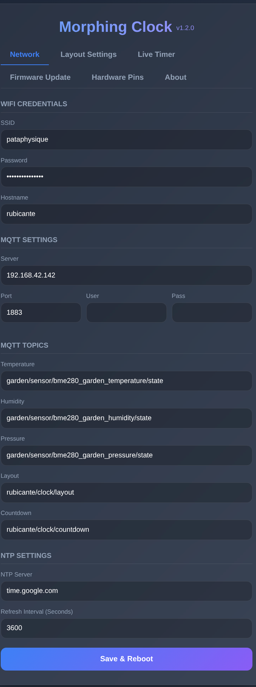
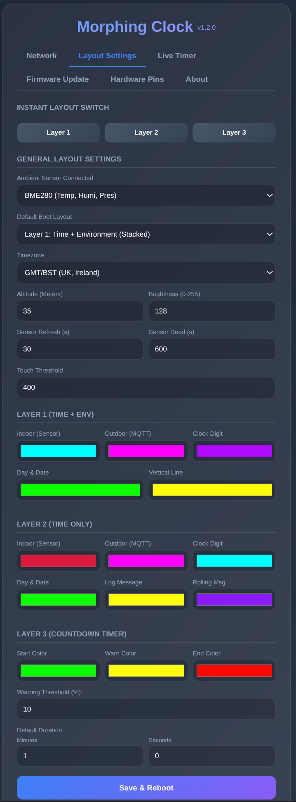
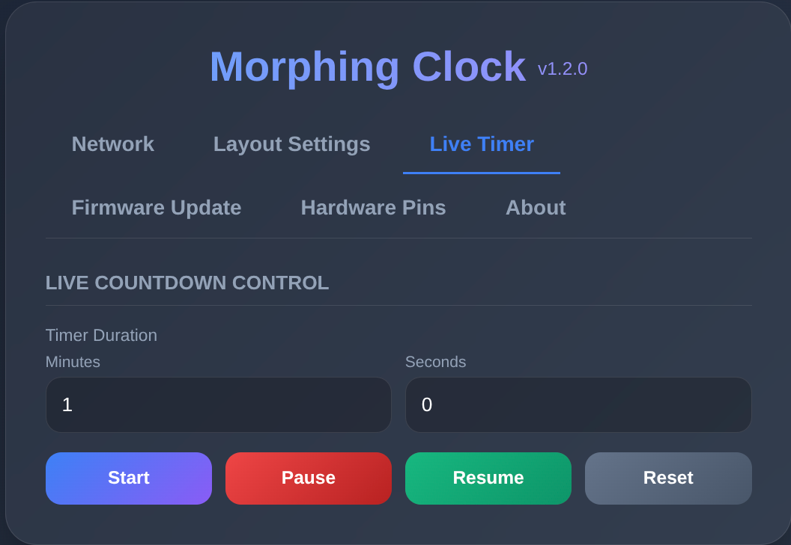
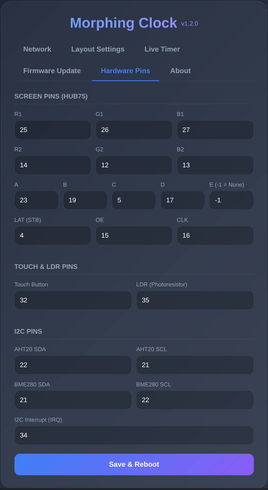
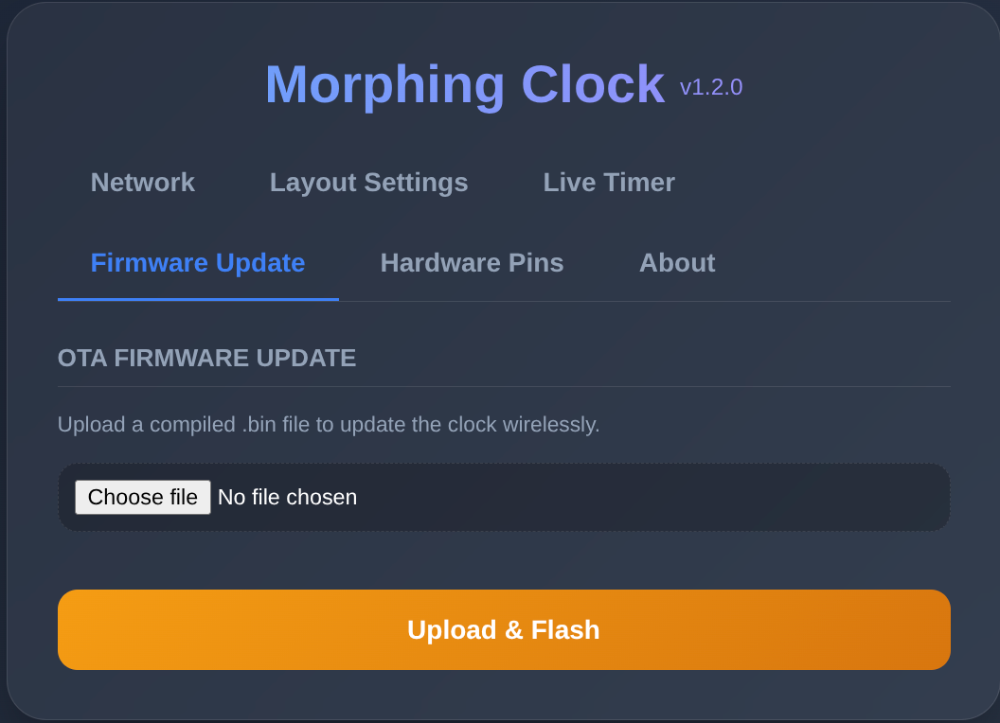

# Yet another ESP32 Morphing Clock

this is an evolution of this code https://github.com/bogd/esp32-morphing-clock.git
and work with this shield https://github.com/hallard/WeMos-Matrix-Shield-DMA
vibe coded to death with gemini, the panel is HUB75 P4 64x32.

## Features

* **Morphing Clock Animation**: Animated digit transitions for displaying time.
* **HUB75 DMA Matrix Display**: Rendering on HUB75 LED matrix panels using ESP32 I2S DMA.
* **Multiple Layouts**:
  * **Layer 1**: Stacked Time + Environmental Data (Indoor/Outdoor).
  * **Layer 2**: Alternating Time Only.
  * **Layer 3**: Countdown Timer.
* **Web Configuration Portal**: A Web UI (`http://<clock-ip>/`) to configure colors, WiFi, MQTT, timezone, default layout, brightness, sensor type, and altitude.
* **Wi-Fi & Fallback AP**: Connects to a local Wi-Fi network. If the connection fails, it hosts an Access Point (`MorphClock`) for initial configuration.
* **NTP Time Sync**: Fetches and maintains time via NTP, including timezone and DST support.
* **Environmental Sensors Support**: Reads local indoor data via I2C using a **BME280** (Temp, Humidity, Pressure) or an **AHT20** (Temp, Humidity).
* **MQTT Integration**: Subscribes to topics to display external sensor data (Temperature, Humidity, Pressure) and allows remote triggers for layout changes or countdowns.
* **Countdown Timer**: Countdown feature with configurable color phases (start, warning, end thresholds).
* **Capacitive Touch Button**: Cycle through display layouts using a touch-sensitive connection on Pin 32.
* **OTA Firmware Updates**: Supports flashing new firmware over Wi-Fi via `ArduinoOTA` or by uploading a `.bin` file through the Web UI.

## Web Interface

The clock includes a built-in web portal for configuration and live control:

### Network
Configure Wi-Fi credentials, NTP time server, timezone offset/DST, and MQTT broker connection details.

### Layout Settings
Adjust screen brightness, select default display layers, set sensor polling intervals and altitude/temperature offsets, and customize color schemes for digits, seconds, and environmental metrics.

### Live Timer
Trigger and manage live countdown timers with real-time feedback and configurable alert phases.

### Hardware Pins
Configure I2C pins (SDA/SCL), capacitive touch input, and select environmental sensor type (BME280, AHT20, or None).

### Firmware Update
Easily flash new firmware builds directly through the browser without needing a serial cable.

